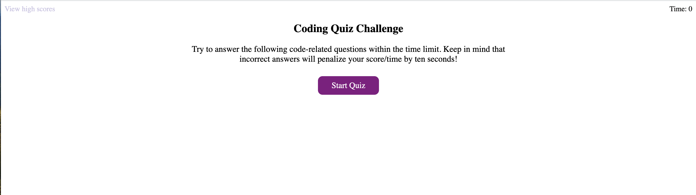

# Code Quiz

## Description

In this application I created a quiz using Javascript and web APIs (Application Program Interface). The web APIs helped me traverse and manipulate the DOM (Document Object Model). This is a fun interactive quiz developed to help people learn about programming with enjoyment.

### Take-Aways

- My motivation for this project was to increase my skills for manipluting HTML with javascript through APIs.

- The problem my code quiz solved was that it helps people learn and cement their knowledge in JavaScript in a fun and timely manner.

- I learned about web APIs and more advanced notions of JavaScript.

## Usage

This appilcation is an interactive quiz about programming.

- When you click the Start Quiz button a the game starts setting a 75 second timer in which you are then presented with the first question.
    - If you answer a question wrong it subtracts 2 points from your score and subtracts 10 seconds from the clock.
    - If you answer a question correct it adds 10 points to your score
    - Whether you answer a question correct or incorrect the next question will appear right after your selection
- At the end of the questions or when the timer hits zero you are then given your score
    - You are then allowed to write your intials with your score to localStorage
    - All highscores are presented on a list in which you can always access with the view high scores button
        - You can either clear the highscores list with a button or go back and take the quiz again

**[Deployed Application](https://kpierce236.github.io/Code-Quiz/)**

### Screenshot of Application

## Credits

### Tutorials

- [MDN web docs](https://developer.mozilla.org/en-US/docs/Web/JavaScript)
- [Writing a README](https://coding-boot-camp.github.io/full-stack/github/professional-readme-guide)

## License

Please refer to license in the repo.